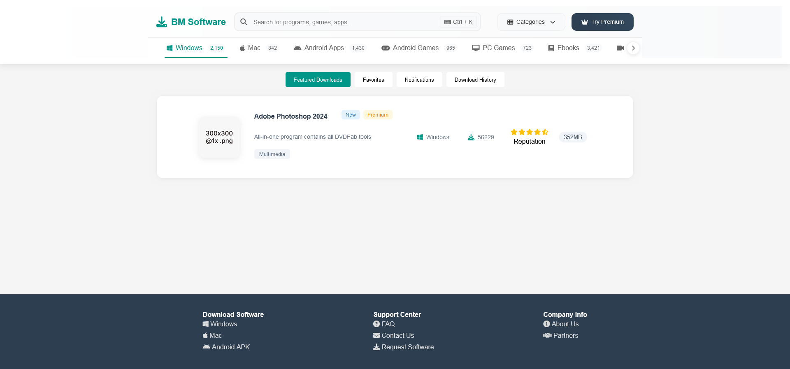

# Modern Software Download Platform

A modern and responsive web platform for downloading software, built with HTML, CSS and JavaScript. The platform features a clean and intuitive interface with smooth animations and transitions.

## Key Features

- Clean and modern UI design with smooth animations
- Responsive layout that works across desktop and mobile devices 
- Software cards with detailed information including:
  - Software icon and title
  - Description and tags
  - Platform compatibility
  - Download count and ratings
  - File size
  - Premium/New badges
- Navigation menu with popular categories
- Search functionality
- Tabbed interface for Featured Downloads, Favorites, etc
- Footer with quick links and platform information

## Technical Details

- Built with semantic HTML5
- Modern CSS including:
  - Flexbox for layouts
  - CSS Grid for category listings
  - CSS animations and transitions
  - Media queries for responsiveness
- JavaScript for interactive features
- Font Awesome icons
- Mobile-first approach

## Browser Support

The platform is compatible with all modern browsers including:
- Chrome
- Firefox 
- Safari
- Edge

## Getting Started

1. Clone the repository
2. Open index.html in your browser
3. No build process required - just plain HTML/CSS/JS
